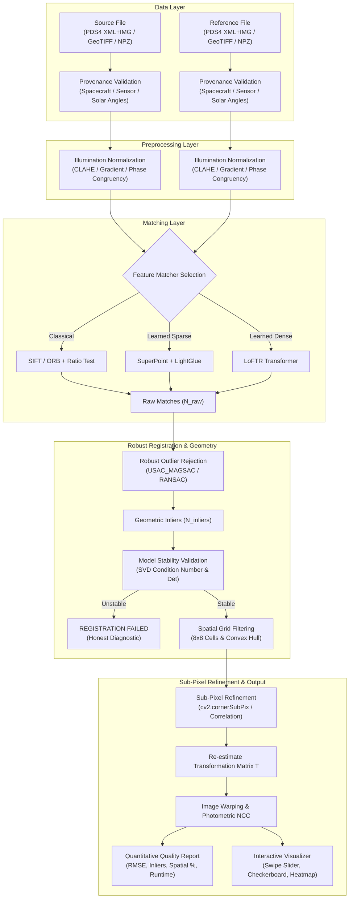

# System Architecture & Mathematical Specification
**Smart India Hackathon 2026 — Problem Statement SIH26166**

---

## 1. High-Level Architectural Flowchart

---

## 2. Mathematical Formulations

### A. Geometric Transformation Models

#### 1. Affine Transformation (6 Degrees of Freedom)
Maps 2D source coordinates $\mathbf{p} = [x, y]^T$ to reference coordinates $\mathbf{p}' = [x', y']^T$:
$$\begin{bmatrix} x' \\ y' \end{bmatrix} = \begin{bmatrix} a_{11} & a_{12} \\ a_{21} & a_{22} \end{bmatrix} \begin{bmatrix} x \\ y \end{bmatrix} + \begin{bmatrix} t_x \\ t_y \end{bmatrix}$$
Optimal for local pushbroom strip pairs where terrain height variations are moderate relative to orbital altitude ($H \approx 100\text{ km}$).

#### 2. Planar Homography (8 Degrees of Freedom)
Projective transformation representing perspective shifts across non-parallel camera planes:
$$\begin{bmatrix} x' \\ y' \\ 1 \end{bmatrix} \sim \begin{bmatrix} h_{11} & h_{12} & h_{13} \\ h_{21} & h_{22} & h_{23} \\ h_{31} & h_{32} & h_{33} \end{bmatrix} \begin{bmatrix} x \\ y \\ 1 \end{bmatrix}$$
In inhomogeneous coordinates:
$$x' = \frac{h_{11}x + h_{12}y + h_{13}}{h_{31}x + h_{32}y + h_{33}}, \quad y' = \frac{h_{21}x + h_{22}y + h_{23}}{h_{31}x + h_{32}y + h_{33}}$$

### B. Transformation Stability & Conditioning
To prevent degenerate or physically impossible image collapses, the $2 \times 2$ linear component $A = \mathbf{T}_{:2, :2}$ undergoes Singular Value Decomposition:
$$A = U \Sigma V^T, \quad \Sigma = \text{diag}(\sigma_1, \sigma_2), \quad \sigma_1 \ge \sigma_2$$
The condition number $\kappa(A)$ and determinant $\det(A)$ are verified:
$$\kappa(A) = \frac{\sigma_1}{\sigma_2} \le 10^5, \quad \det(A) = \sigma_1 \sigma_2 > 0$$
If $\det(A) \le 0$ (reflection of lunar surface) or $\kappa(A) > 10^5$ (singular/collapsed axis), the transformation is rejected.

### C. Reprojection Root Mean Squared Error (RMSE)
Evaluated strictly over the set of $M$ verified inliers:
$$\text{RMSE} = \sqrt{\frac{1}{M} \sum_{i=1}^{M} \| \mathbf{p}'_i - T(\mathbf{p}_i) \|_2^2}$$
Sub-pixel refinement computes:
$$\Delta \text{RMSE} = \text{RMSE}_{\text{coarse}} - \text{RMSE}_{\text{refined}}$$

### D. Spatial Distribution Metrics
1. **Convex Hull Coverage Ratio**:
   $$\text{Coverage} = \frac{\text{Area}(\text{ConvexHull}(\mathbf{p}_{\text{inliers}}))}{\text{Area}(\text{Image Overlap Bounding Box})} \times 100\%$$
2. **Grid Cell Occupancy Ratio**:
   Subdivides the scene into an $R \times C$ grid (default $8 \times 8 = 64$ cells):
   $$\text{Occupancy} = \frac{\sum_{r=1}^{R} \sum_{c=1}^{C} \mathbb{I}(\text{Count}(r, c) \ge 1)}{R \times C} \times 100\%$$

### E. Photometric Normalized Cross-Correlation (NCC)
Evaluated on mutually overlapping non-zero warped pixels $\Omega$:
$$\text{NCC} = \frac{\sum_{(x,y) \in \Omega} (I_{\text{warped}}(x, y) - \bar{I}_{\text{warped}})(I_{\text{ref}}(x, y) - \bar{I}_{\text{ref}})}{\sqrt{\sum (I_{\text{warped}} - \bar{I}_{\text{warped}})^2 \sum (I_{\text{ref}} - \bar{I}_{\text{ref}})^2}}$$
Bounded in $[-1.0, 1.0]$, providing an independent radiometric check of registered surface features.
